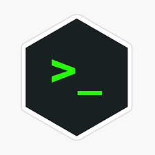
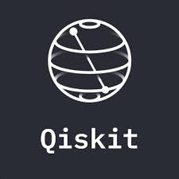
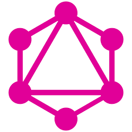
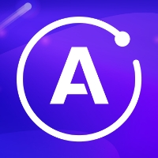
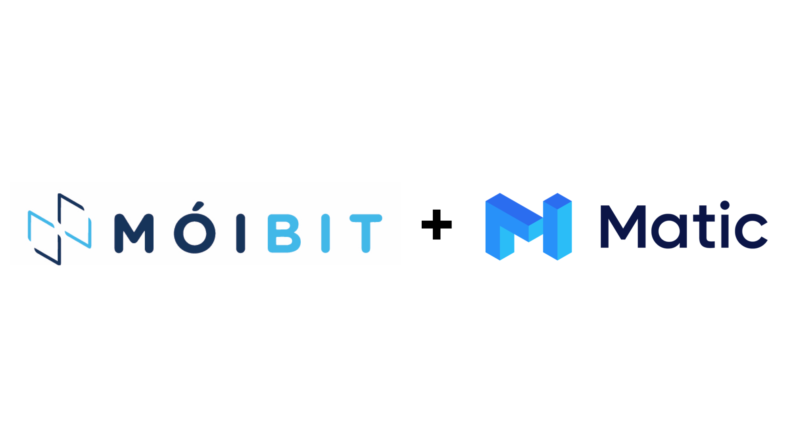
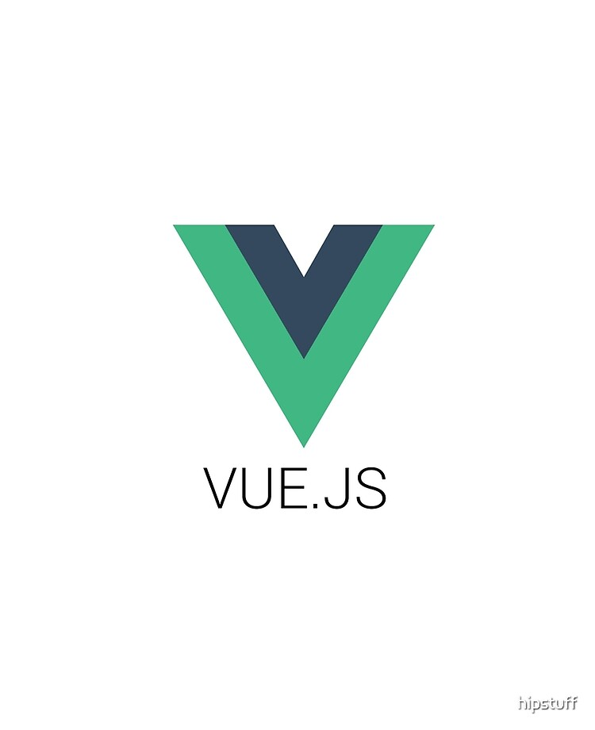

# I'm [*Ansh Sarkar*](https://www.linkedin.com/in/ansh-sarkar-1150511b0/) :sunglasses: (The Boulder 🪨)

<!---->


 

[](https://discordapp.com/channels/@me/cryonit/) &nbsp;
[](https://twitter.com/iBouldr)  &nbsp;
[](https://www.linkedin.com/in/ansh-sarkar/)  &nbsp;
[](https://github.com/Ansh-Sarkar)  &nbsp;
<a href="mailto:anshsarkar18@gmail.com"> 

## Welcome to my World :earth_asia: . . .
My name is **Ansh Sarkar** :raising_hand: a.k.a **SeraphimCoder** and I am a 21 year old **Web Developer** :zap: , **Cyber-Sec Enthusiast** :lock:, **UX designer** :artist: , **Researcher** :microscope: and a **Book Worm** :book:. I love learning new stuff :bulb: which has a future/value in the global market. I love increasing connections :two_men_holding_hands: and looking out for every oppurtunity I can grab. I love competitive coding :trident: and spend a fair amount of time :hourglass: going through business case studies or research papers :sparkles:. 

## Who am I :point_down:?
```python
 from Ansh_Sarkar import personal_details
 # from Ansh_Personal import personal_ambitions
 
 class WhoAmI:
 	name = 'Ansh Sarkar'
	current_education = "B.Tech CSE"
	hobbies = [
				'Drawing',
				'Watching Sci-Fi',
				'Reading Sci-Fi Novels',
				'Learning New Programming Languages or Frameworks',
        			'Making friends ...'
			]
			
	# return city name ...
	def getCity():
		retrun Siliguri_WestBengal_India_Asia_Earth()
		
	# return public ambitions ...
	def Ambitions():
		Become_A_Billionaire()
		Create_An_Ironman_Suit()
		Be_The_Best()
		# private_ambitions out of scope :-)
	
```
## My Top 4 Role Models :scientist:
[**Elon Musk**](https://en.wikipedia.org/wiki/Elon_Musk) [**(SpaceX)**](https://en.wikipedia.org/wiki/SpaceX)| [**Bill Gates**](https://en.wikipedia.org/wiki/Bill_Gates) [**(Microsoft)**](https://en.wikipedia.org/wiki/Microsoft)| [**Mukesh Ambani**](https://en.wikipedia.org/wiki/Mukesh_Ambani) [**(Reliance)**](https://en.wikipedia.org/wiki/Reliance_Industries)| [**Jeff Bezos**](https://en.wikipedia.org/wiki/Jeff_Bezos) [**(Amazon)**](https://en.wikipedia.org/wiki/Amazon_(company))
--- | --- | --- | ---
 |  |  |  

#

<h2 align="center"> Languages :computer: and Frameworks I Love :heart: </h2>
<br/>
<div align="center">
	
	
	
	
	
	
	
	
	
	
	
	
	
	
	
	
	
	
	
	
	
	
	
	
	
</div>

#

<div align="center">
	<a href="https://github.com/Ansh-Sarkar">
	  
	</a>
	<a href="https://github.com/Ansh-Sarkar">
	  
	</a>
</div>


<!---->

<!--[](https://github.com/anuraghazra/github-readme-stats)-->
## Current Status
- 🔭 I’m currently working on improving :construction: my coding skills
- 🌱 I’m currently learning Algorithmic Analysis :chart_with_upwards_trend:
- 👯 I’m looking to collaborate with future Entrepreneurs :scientist: with cool ideas :bomb: and projects
- 💬 Ask me about anything , always happy to help :wink:
- 📫 How to reach me: Please refer to the **Contact Me** section :point_down: or the **Header** :point_up:

## Contributions :file_folder:
1. If you think that any of my repositories :mailbox_with_mail: could be better please feel free to raise an Issue :hand: or let me know via email :email:.
2. If you have solved :heavy_check_mark: any previously raised Issue(s) please feel free to open a Pull Request :scroll: (P.R.) , if it contributes some value to the repository I will surely merge it :link:.
3. Please do not spam :x:.

## Contact Me 
Have a Project ? Think I can contribute ? Need some help ?
Feel free to shoot a mail to : **anshsarkar18@gmail.**
Please do provide me some time to get back to you. In most cases I respond within 24-48 hrs .
You can also contact me via LinkedIn. To connect , click on the LinkedIn tab in the header section of this Readme . . .

:copyright: ReadMe Designed by Ansh Sarkar a.k.a SeraphimCoder

##
Note : Although Responsive , this ReadMe is best viewed at 1280 x 720 resolution
