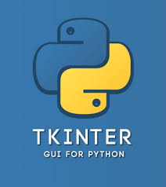

<h1 width="100"><a href="https://www.linkedin.com/in/Ansh-Sarkar">The Boulder</a> 🪨</h1> 

 

 &nbsp;
  &nbsp;
  &nbsp;
  &nbsp;
<a href="mailto:anshsarkar18@gmail.com"> 

<i>कर्मण्येवाधिकारस्ते मा फलेषु कदाचन । मा कर्मफलहेतुर्भुर्मा ते संगोऽस्त्वकर्मणि ॥</i>

 

My name is <strong>Ansh Sarkar</strong> a.k.a <strong>The Boulder</strong> and I am a 23 year old Software Engineer. I love learning & building systems that scale, increasing connections and looking out for oppurtunities I can grab. I'm also into competitive coding while spending a fair amount of time going through business case studies and research papers. I am a firm believer that "Knowledge is Power" and strive to learn something new every single day.

 

	
	
	
	
	
	
	
	
	
	
	
	
	
	
	
	
	
	
	
	
	
	
	
	
	

 

	
	

	<picture>
	  <source media="(prefers-color-scheme: dark)" srcset="https://raw.githubusercontent.com/Ansh-Sarkar/Ansh-Sarkar/snake-output/github-contribution-grid-snake-dark.svg" />
	  <source media="(prefers-color-scheme: light)" srcset="https://raw.githubusercontent.com/Ansh-Sarkar/Ansh-Sarkar/snake-output/github-contribution-grid-snake.svg" />
	  
	</picture>

## Role Models :scientist:
[**Elon Musk**](https://en.wikipedia.org/wiki/Elon_Musk) [**(SpaceX)**](https://en.wikipedia.org/wiki/SpaceX)| [**Bill Gates**](https://en.wikipedia.org/wiki/Bill_Gates) [**(Microsoft)**](https://en.wikipedia.org/wiki/Microsoft)| [**Mukesh Ambani**](https://en.wikipedia.org/wiki/Mukesh_Ambani) [**(Reliance)**](https://en.wikipedia.org/wiki/Reliance_Industries)| [**Jeff Bezos**](https://en.wikipedia.org/wiki/Jeff_Bezos) [**(Amazon)**](https://en.wikipedia.org/wiki/Amazon_(company))
--- | --- | --- | ---
 |  |  |  

<!-- Add the "START_SECTION:waka" part after sufficiently building contribution history -->
<!-- Add the "END_SECTION:waka" part after sufficiently building contribution history -->

<!---->

<!---->
## Current Status
- 🔭 I’m currently working on improving :construction: my coding skills
- 🌱 I’m currently learning Algorithmic Analysis :chart_with_upwards_trend:
- 👯 I’m looking to collaborate with future Entrepreneurs :scientist: with cool ideas :bomb: and projects
- 💬 Ask me about anything , always happy to help :wink:
- 📫 How to reach me: Please refer to the **Contact Me** section :point_down: or the **Header** :point_up:

## Contributions :file_folder:
1. If you think that any of my repositories :mailbox_with_mail: could be better please feel free to raise an Issue :hand: or let me know via email :email:.
2. If you have solved :heavy_check_mark: any previously raised Issue(s) please feel free to open a Pull Request :scroll: (P.R.) , if it contributes some value to the repository I will surely merge it :link:.
3. Please do not spam :x:.

## Contact Me 
Have a Project ? Think I can contribute ? Need some help ?
Feel free to shoot a mail to : **anshsarkar18@gmail.**
Please do provide me some time to get back to you. In most cases I respond within 24-48 hrs .
You can also contact me via LinkedIn. To connect , click on the LinkedIn tab in the header section of this Readme . . .

:copyright: ReadMe Designed by Ansh Sarkar</a> :sunglasses: (The Boulder 🪨)

##
Note : Although Responsive , this ReadMe is best viewed at 1280 x 720 resolution
